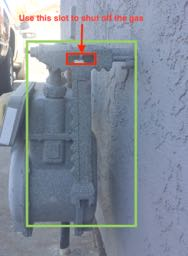

# Family Disaster & Emergency Action Plan (EAP)

**Important information and reference materials used in emergencies and disasters**

## Emergency Action Plan
**Summary** - The goal of this Emergency Action Plan (EAP) is to respond to an emergency in a coordinated effort with  preplanned actions, reducing the need to think in an emergency and reducing actions that can increase risk.  This EAP has 3 main goals:

1. Get out of immediate danger (Duck, Cover, and Hold)
2. Determine the nature of the emergency (shelter in place or evacuate)
3. Communicate with loved ones

Each goal is detailed below

__Get out of immediate danger__
For all emergencies, getting out of immediate danger requires assessing the situation to determine if there are any immediate threats to yourself, others around you, or pets, and if so, taking steps to mitigate these threats. The first thing we forget to use is our senses. **STOP** Listen, Look, Touch, and Smell.

Here are simple questions to ask when determining if there is an immediate threat:

- [ ] Touch & Look; Is anyone bleeding? Feel for wounds, look for blood on your fingers
- [ ] Touch; Is the building/car/train shaking?
- [ ] Look; Is anything obstructing movement or an exit?
- [ ] Listen; do you hear anyone screaming?
- [ ] Listen; do you hear sirens or a loudspeaker?
- [ ] Smell; Do you smell gas, smoke?

For an Earthquake, getting out of immediate danger means **Duck, Cover and Hold.**

**Duck:** Drop to the floor. Getting down on the floor is safer because it prevents you from falling when trying to move.

**Cover:** Crawl under a sturdy desk or piece of furniture like a table. If there is nowhere to crawl under, put your back up against an interior wall, pull your knees into your chest and cover your head with your arms.

**Hold:** Hold onto the furniture until the shaking stops. If you are not under a piece of furniture, just hold your protecting position. An earthquake can last for a minute or more.

__Determine the nature of the emergency__
The primary goal of determining the nature of the emergency is to decide if you should to **shelter in place or evacuate** to a safer location or meet-up location.  Secondary goals are to gather information in order to determine if there are simple steps that you can take to stop or minimize the emergency.  Determining if you are to shelter in place or evacuate can be deduced by the type of emergency: is it a natural disaster, like an earthquake or fire, or a man-made emergency, like a terrorist attack or auto accident.  Other ways to deduce this is by the news, or by listening to a radio or an Emergency Broadcast System (like a loudspeaker).  Use common sense to determine if you are going to leave and know your exit routes and your limits:  **Don’t become a victim.**

__Communicate to loved ones__
Communicating with loved ones is key: one goal of disaster planning is to know that your family is safe. It is paramount to communicate your status to family members throughout an entire emergency.

What to communicate | Sample Question
--------------------|----------------
Physical Status|Are you hurt? Are you with people? Do you have pets?
Mental Status |Is something wrong? Are you stressed?  Are you impaired?
Where you are?| Where are you located? Work, home, other location?  
Where you are going?| Are you staying put?  Evacuating?  To a meet-up location or a different place?
When will we speak again?| Set a time to speak again. Set the alarm on your phone or watch
What is your ETA? |  How are you getting there? What time do you expect to get there?
Resources| Do you have water?  Do you have emergency supplies? Do you have a car, bike or other transportation? Are you with people?

## Emergency Alerts & Warnings
**Summary** - Having a heads up that an issues that are developing will help you stay clear of issues and make informed decisions. Two is one and one is none, ensure that you have redundant methods to receive the alerts and that all parties included in your action plan also receive alerts for areas where you will be traveling. Using a service like [Nixle](http://www.nixle.com/), can provide you with push notifications and emails from local emergency services.

Having access to amateur radio can afford you the ability to tune to local non-digital emergency services. However most groups now coordinate with digital encrypted radio channels.

**Solano County:**

Agency | Radio Frequencies
---|---
Solano Sheriff | 155.490
NOAA | 162.425

## Communication
**Summary** - Communication is essential during an emergency, there is nothing better than knowing that your loved ones are okay. This section is focused on the method of communication, what to communicate is in the section above. Building a communication plan is almost as important as practicing it.
The methods of communication are categorized under SMS/Text, Cell Phone/ Land Line, HAM Radio. Contacts are broken into three categories Local, Regional, and Long Distance.
Local within walking distance, meaning you could walk to the location within reason. For example we could walk to Susan from our home, Susan would be considered a local contact.
Regional outside of walking distance but within a car ride to the location. Berkeley, and El Dorado would be considered examples of regional.
Long Distance any location outside of the regional, Ideally these are locations that wouldn’t be directly impacted by the event.
Methods of communication should be from simplest to complex, depending on the event. The goal of the communication is leave enough information so that resources and decisions can be made in your absence. Follow the order in each method below until you have made a successful contact.

**SMS/ Text -** SMS uses the least amount of bandwidth, and doesn’t require a full signal to make a successful transmission

**Cell Phones -** Wireless carries are limited by number of towers times the number of active connections.  In a regional emergency cell phones may not be effective, but worth trying.

**Analog Land Lines -** Traditional land lines, or analog phones have been phased out for digital cordless devices. During an emergency office PBX systems can be stressed and require a power source. The fancy digital phone you have home may also require power (headset and base). Locating a true analog phone during an emergency can be challenging, it’s recommend having one at home.

**Amateur Radio -** Requires a FCC license and training. Handheld and mobile stations can utilize regional repeaters with emergency power. Some repeaters have an “auto patch” mode that allows an analog call to be placed. You also have the ability to use the ARES network were trained emergency radio operator’s can relay a message to local, regional, and long distance contacts.

**Channel Reference:**

Category | Memory Channel | Net Name | Frequency | Offset |  Tone
---|---|---|---|---|---
Local Simplex|0|"Home"|144.240|n/a|n/a
Local Repeater - Concord|1|W6CX|147.06|+0.6 MHz |100.00
Local Repeater - Contra Costa | 2| WA6KQB|145.11| -0.6 MHz|82.5
Local Repeater - Berkeley | 3| KB6LED|145.290|-0.6 MHz| 131.8
Local Repeater -Vacaville | 4| W6VVR| 145.470|-0.6 MHz|127.30
Regional Repeater -Vacaville| 5| N6ICW|147.195| +0.6 MHz | 123.00

**Radio Maintenance Checklist**

- [ ] Battery Life HH:MM
- [ ] TX/RX Check
- [ ] Physical Condition (absence of corrosion, cracks in case)

**Emergency Communication Reference List:**

__**Verify all numbers prior to implementation**__

This list is to be used as a written reference to reach people and agencies as needed. Do not assume that the stored numbers in your mobile device will be reachable in an emergency.

Agency| Number | Alt Number
---|---|---
Suisun Police |707-421-6622 (Emergency) :rotating_light:|707-421-7373 (Non-Emergency)
Solano Sheriff|:rotating_light: |
Suisun Fire Department|707-421-7205 :rotating_light:|
Kaiser :hospital: |707-427-4025 (Fairfield)| 707-624-2600 (Vacaville)
Poison Control | 1-800-222-1222|
PG&E |1-800-743-5000|
Water Sewage |707-421-7373
Long Distance Emergency Contact |  |
Regional Emergency Contact | |
Local Emergency Contact | |
Child's School | |
Nuclear Family Member | |
Nuclear Family Member | |
Evacuation Zone |Kroc Center |Dan O. Root Elementary School
California Emergency Management Agency | 916-845-8510 | 3650 Schriever Ave, Mather, Ca 95655
Animal Control | 707-449-1700 | 707-784-1356 (Fairfield Animal Shelter)
Sand + Sandbag Locations  |   |  701 Civic Center Blvd, behind police department
Red Cross  | (707) 438-7060  | 1545 N. Texas Street Fairfield, CA 94533

## Shelter-in-place & Evacuation
**Summary** - Remember, the goal is to evacuate to safety or find the safest shelter-in-place location. It is extremely important to pause for a moment to decide if it is safer to be outside or inside during an event.  Listen to your instincts. For example, during an earthquake, it may be safer to be outside to avoid a building structural collapse, but during a biohazard incident, it may be safer to be inside, with the doors locked and all windows closed and sealed.

__Evacuation or Shelter-in-place ?__

If you are home when an emergency occurs, it is important to quickly decide if you can get out the front door, or if you need to shelter-in-place for a period of time. Take in to account the time needed to get the animals.  You DO NOT need to get the emergency supplies; the survival gear is useless if you are injured or killed trying to retrieve it before evacuating.
About evacuating or sheltering with pets
Don't try to hold your pet during a quake. Animals instinctively want to hide when their safety is threatened. If you get in their way, even the nicest pets may hurt you.
Watch animals closely. Leash dogs and place them in a fenced yard.
Pets may not be allowed into shelters for health and space reasons. Prepare an emergency pen for pets in the home that includes a 3-day supply of dry food and a large container of water.
If you can't find your pet or must leave it at home after a quake, leave fresh water in non-spill containers such as bathtubs and sinks. Leave plenty of low-fat dry food, which deteriorates more slowly and is less tasty so pets won't try to eat it all at once. Leave a note indicating that you have a pet, where you will be and the date.

__Shelter-in-place - Home__ - If you shelter in place, make sure you get the dog(s) into a safe place (kennel).  The kitchen is the best place to shelter-in-place.

__Inspect__ - Immediately after event, start inspection of house. You want to confirm that the house is safe for shelter in place.

Checklist | Status | Notes
---|---|---
Smells (rotten egg, smoke)  |   |  
Water pipes (under sinks)  |   |  
Doors (open/close freely)  |   |  
Windows (broken open/close)  |   |  
Cracks in walls  |   |  
Outside (sounds/ smells)  |   |  
Outside cracks  |   |  
Outside obstructions (power lines / trees)  |   |  

__Shut Off Gas__ -
In an emergency, your gas can be turned off at the main gas service shutoff valve. Do not shut off the gas unless you smell gas, hear gas escaping, see a broken gas line or suspect a gas leak. If you shut off the gas, there may be a considerable delay before PG&E can turn your service back on.
We have a gas wrench attached to the meter, you will need to cut the zip-tie to remove it. Turn the gas valve 45’ so that the slot is perpendicular to the ground.

__Get informed__ - We have a hand crank radio in the yellow bag in the garage. You will need to crank the radio for   ~ 1 min to get 45 secs of play. Make a game of who can crank the radio the longest. Make sure that the power selector is set to “rechargeable” and the radio is off before cranking. There are “C” batteries in the garage that will power the radio as well, you will need to move the power selector to “Dry” to take advantage of this power source.

FM stations will provide you with the best reception during the day, and is easier to scan for news. Tune to 90.9 / 89.3 / 88.5

AM stations will provide you will a longer distance ( incase local stations are without power) and will work especially well after the sunset. Tune to 740, 810 (SF) or 1140, 1530(Sacramento) and possibly 770 (Manteca).

The mobile go radio in the office has a 12v battery and can be used to monitor NOAA and Solano Sheriff, along with other vital local and regional services. You’ll get better reception on outside with the mag antenna. Once the battery is depleted, you’ll need A/C to recharge it. Estimated run time is 4 hours, and depending on transmission power will decrease. There is a USB charger on the unit, reserve what you charge.
Execute the Communication Plan once you have confirmed that you are safe.

__Shelter-in-place - Work__ -
